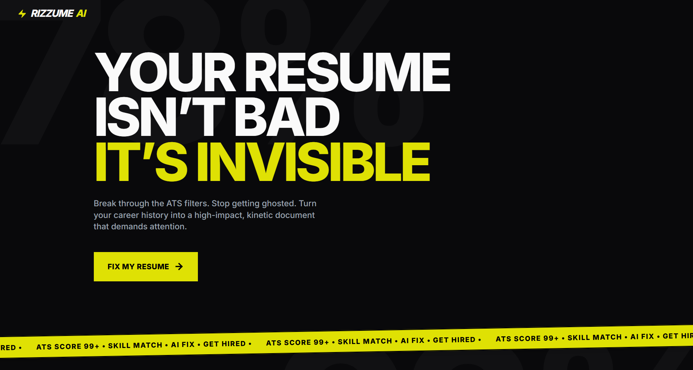

# ⚡ Rizzume AI - The Ultimate ATS Optimizer

<div align="center">
  
  
  
  
  
</div>

<br/>

**Rizzume AI** is a full-stack, microservices-based application designed to beat Applicant Tracking Systems (ATS). It acts as a "mock ATS," using Natural Language Processing (NLP) to score resumes against Job Descriptions, brutally roast weak bullet points, and generate a personalized 30-day learning roadmap to bridge skill gaps.

🔗 **[Live Demo Here](https://rizzume-ai.netlify.app/)** 

---

## 📸 Sneak Peek


---

## 🚀 Core Features
- **🔍 Deep ATS Scoring:** Extracts text via PyPDF2 and compares vocabulary weight against the Job Description using a custom ML model.
- **💀 The "AI Roast":** A highly sarcastic generative AI model tears apart generic bullet points and tells you exactly why you're getting ghosted.
- **📅 30-Day Automated Roadmap:** Generates a customized, day-by-day learning plan to help you learn the exact skills your resume is missing.

---

## 🏗️ System Architecture (Microservices)
To ensure scalability and clean separation of concerns, this application steps away from a traditional monolith and uses a decoupled **Microservices Architecture**:

1. **Frontend (React.js):** The highly responsive client layer. Handles UI, secure file uploads, and renders the AI analysis dashboard.
2. **Orchestration Layer (Node.js/Express):** The central nervous system. Receives the PDF, safely forwards it to the ML engine, and communicates with external GenAI APIs.
3. **ML Engine (Python/FastAPI):** An isolated heavy-computation service. Handles PDF text extraction and runs custom ML algorithms (TF-IDF Vectorization) to calculate the keyword weight.

---

## 💻 Tech Stack
| Layer | Technologies Used |
| --- | --- |
| **Frontend** | React.js, Tailwind CSS, Axios, Netlify (Hosting) |
| **Backend API** | Node.js, Express.js, Multer, Render (Hosting) |
| **AI / ML Engine** | Python 3, FastAPI, PyPDF2, Scikit-learn, TF-IDF Vectorizer |

---

## 🧠 Engineering Challenges Solved
Building a microservices architecture introduced several real-world production challenges:

* **Cross-Service File Handling:** Securely transferring PDF buffers from the React frontend → Node.js backend → Python FastAPI service without data loss or corruption using `multer` and `FormData`.
* **Overcoming Cloud "Cold Starts":** Deployed two separate backend environments on free tiers. To prevent 503 Timeout errors and save server hours, I implemented dedicated `/health` routes and engineered specific cron-jobs to ping the servers only during active daytime hours.
* **Smart ATS Keyword Matching:** Instead of basic string-matching, the system uses a **TF-IDF Vectorizer** to understand the mathematical *weight* and *context* of enterprise keywords, providing a highly accurate industry-standard score.

---

## 🛠️ Local Installation & Setup

Because this is a microservices monorepo, you need to spin up the services individually. 

### Prerequisites
- Node.js (v18+)
- Python (3.9+)

---

## 🚀 Getting Started

### 1. Clone the repository
```bash
git clone https://github.com/soumyabyabarta/rizzume-ai.git
```

### 2. Start the ML Engine (Python)
```bash
cd ml_engine
pip install -r requirements.txt
uvicorn main:app --reload
```
The ML Engine will run on: 👉 http://localhost:8000

### 3. Start the Backend (Node.js)
```bash
cd ../backend
npm install
```
Create a .env file in the backend folder and add your environment variables
```bash
npm start
```
The Backend will run on: 👉 http://localhost:5000

### 4. Start the Frontend (React)
```bash
cd ../frontend
npm install
npm start
```
The Frontend will run on: 👉 http://localhost:3000

## 🤝 Contributing
Contributions, issues, and feature requests are welcome!

